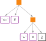

<!-- README.md is generated from README.Rmd. Please edit that file -->
jsvm
====

jsvm is my personal toolbelt package with functions that I often tend to use or had fun making for some specific purpose.

Installation and external dependencies
--------------------------------------

Install the package from github, using `devtools`:

``` r
# install.packages("devtools")
devtools::install_github("janusvm/jsvm")
```

Some functions rely on one or more external programs. Not having these programs will not hinder the installation of the package, but some functionality will be missing. The current dependencies are:

-   `expr2tikz()`:
    -   a LaTeX distribution, for using `pdflatex` to compile standalone tikz figures (also requires the LaTeX packages `fontenc`, `xcolor`, `tikz`, `tikz-qtree`, and `inconsolata` to be installed)
    -   `imagemagick`, for using `convert` to make png files of such figures
    -   `pdf2svg`, for making svg files of such figures

Exported functions
------------------

-   `whoami()`: get filename of executing script when run with Rscript
-   `expr2tikz()`: plot the AST of an expression with TikZ (tikz-qtree) in the style of the figures in [Advanced R: Expressions](https://adv-r.hadley.nz/expressions.html)

Examples
--------

`expr2tikz` creates a tikz string, that (when using the LaTeX package [tikz-qtree](https://ctan.org/pkg/tikz-qtree)) produces a graph representing the abstract syntax tree of an expression, optionally saving the figure as either a pdf, svg, or png.

``` r
filename <- file.path("man", "figures", "README-expr2tikz.svg")
expr2tikz(y <- x * 2, filename)
knitr::include_graphics(filename)
```



More functions and examples to come...
